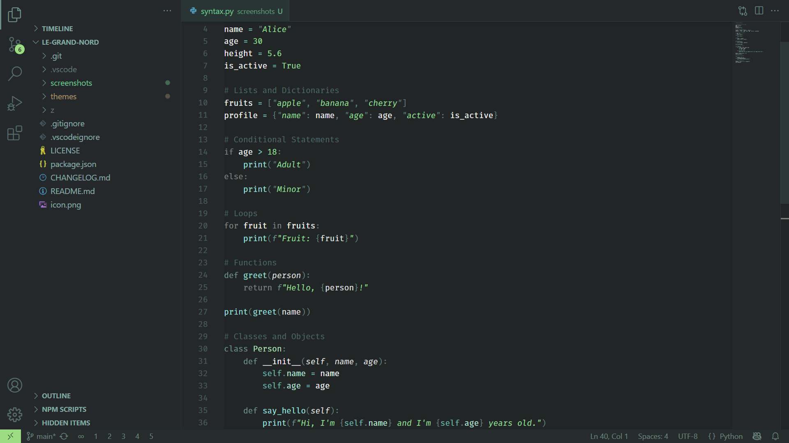

# Le Grand Nord – VS Code Theme

[EN] A minimalist color palette, featuring cool tones and medium contrast for a consistent and calm aesthetic.

[FR] Une palette de couleur minimaliste aux tons froids avec un contraste moyen, pour une esthétique consistente et calme.

## Javascript


## HTML / CSS


## Python



Tags: #nord #flow #concentration #focus #zen #simple #beautiful

---

## More contrast

If you want a better contrast, just add this to your user settings (json):

```jsonc
"workbench.colorCustomizations": {
	// darker:
	"editor.background": "#212525",
	// darkest:
	// "editor.background": "#1d2121",
}
```

Here's what it looks like:


## Contributing

Contributions are welcome! If you have suggestions for improvements, feel free to open an issue.

If you enjoy using this theme, please consider leaving a rating in the [Visual Studio Code Marketplace](https://marketplace.visualstudio.com/items?itemName=ncodefun.le-grand-nord). Your feedback is much appreciated!


## License

[MIT](LICENSE)
