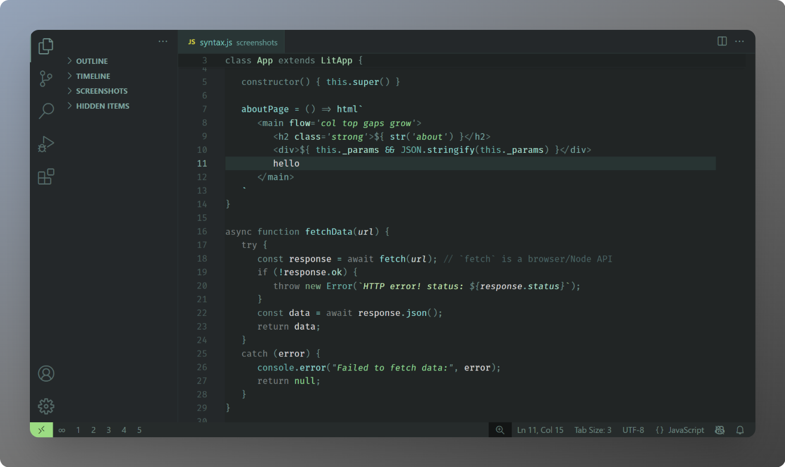
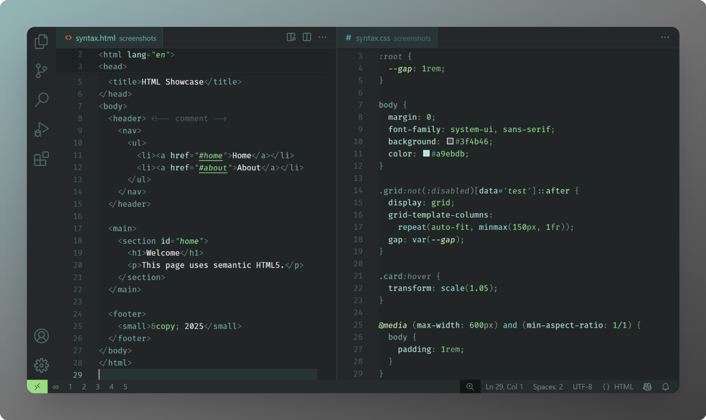
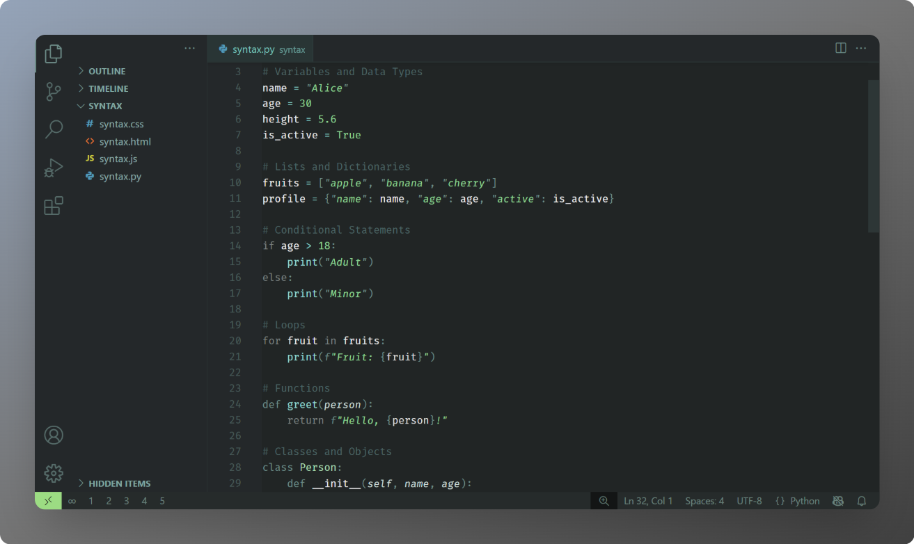
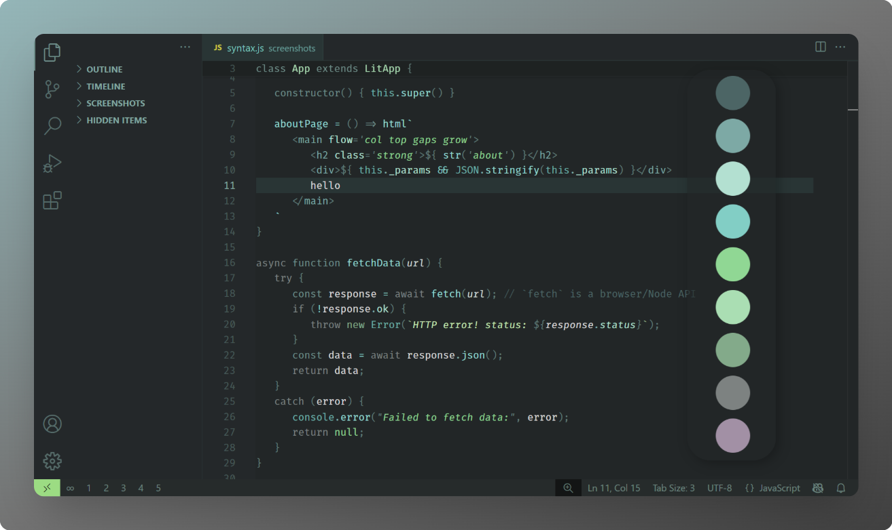
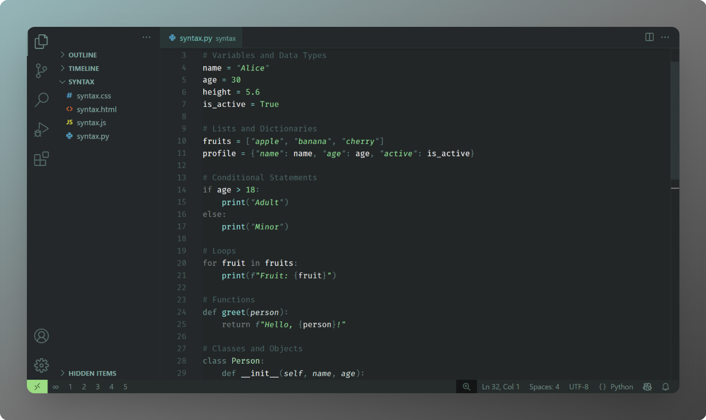
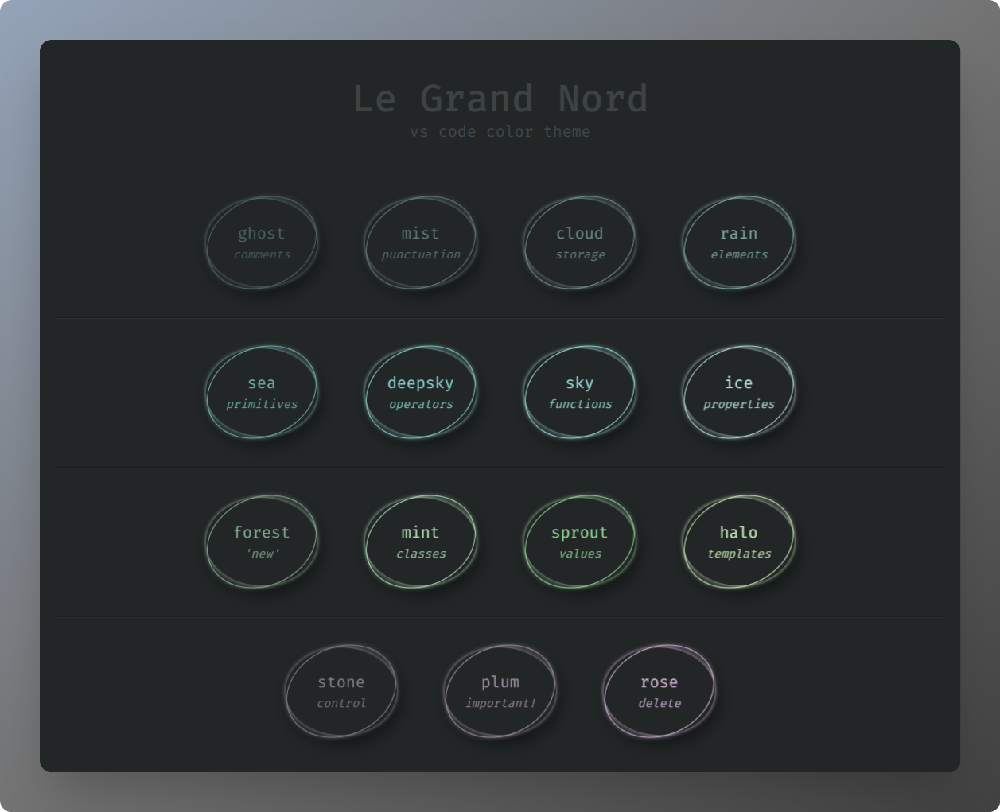
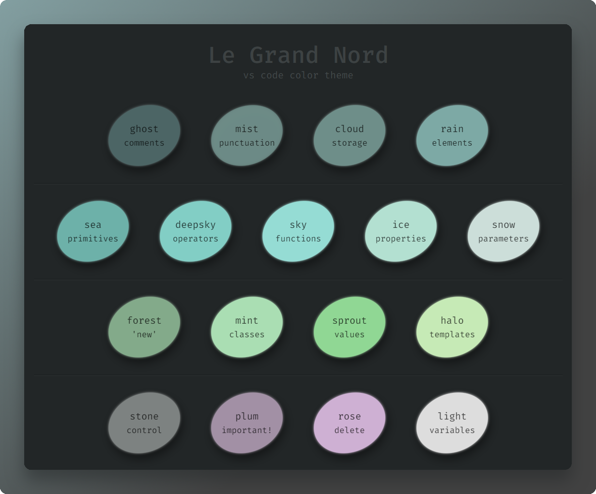

# Le Grand Nord – VS Code color theme

[🌍 Français](README_fr.md)

**For a clear, undistracted vision**

Le Grand Nord is a beautiful, minimalist theme designed for visual ease and focus. Inspired and inspiring with cool Nordic tones and a simple palette, this is your Zen space for noise-free coding. 🌱"

## Le Grand Nord

### Javascript

> [!NOTE]
> → using `lit-html` extension for syntax coloring inside lit templates.

### HTML / CSS

### Python

## Le Grand Nord – Soft

This theme variant (old default theme) provides an even softer contrast (background and punctuation).

### Javascript

### HTML / CSS

### Python

<!-- ## Color palette

 -->

---

If you enjoy using this theme, you're welcome to rate & review 💖

- [Visual Studio Code Marketplace](https://marketplace.visualstudio.com/items?itemName=ncodefun.le-grand-nord&ssr=false#review-details).
- [Open VSX](https://open-vsx.org/extension/ncodefun/le-grand-nord/reviews)

---

Tags: *#nord #flow #concentration #focus #zen #simple #serenity #beautiful*

## License

[MIT](LICENSE)
