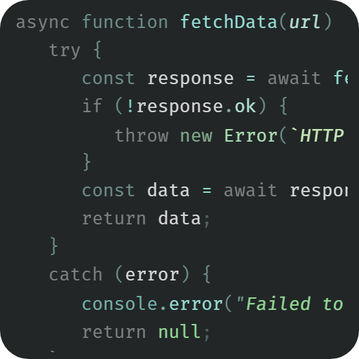

# Le Grand Nord VS Code Theme

A cool minimalist color palette, featuring pastel-like tones and medium contrast for a consistent and calm aesthetic.

## Installation

1. Download or clone this repository.
2. Open the folder in VS Code.
3. Press `F5` to open a new Extension Development Host window with the theme enabled.
4. Or, package and install the extension using `vsce`.

## Screenshots

## Showcases

See the `code-syntax-showcases/` folder for syntax samples in various languages.

## License

[MIT](LICENSE)
