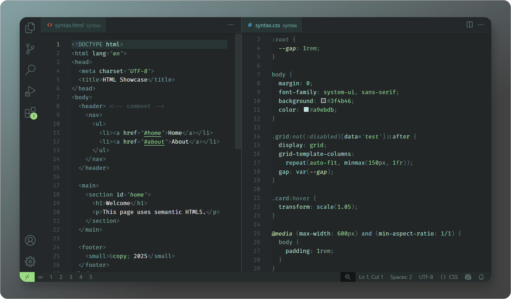
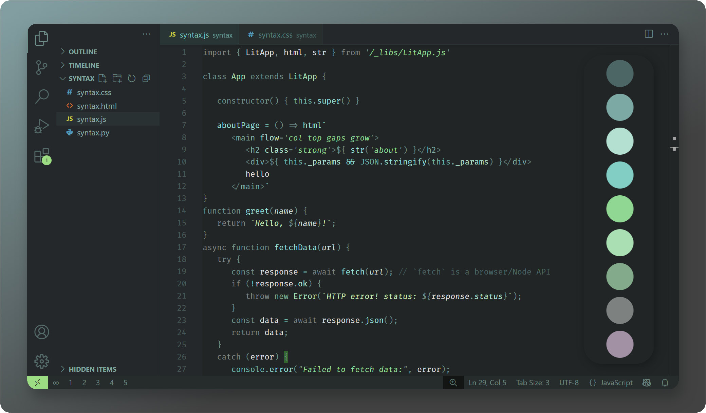
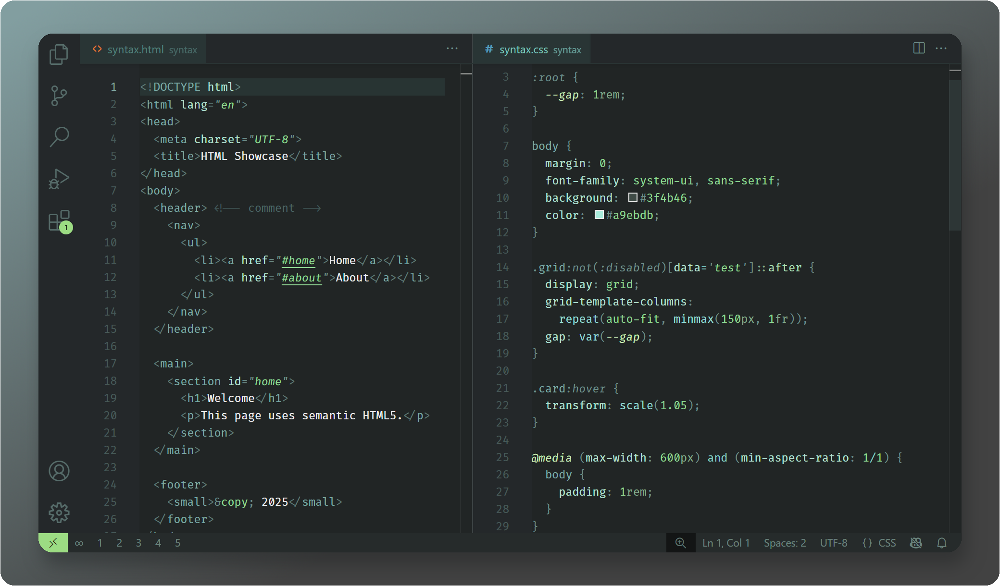
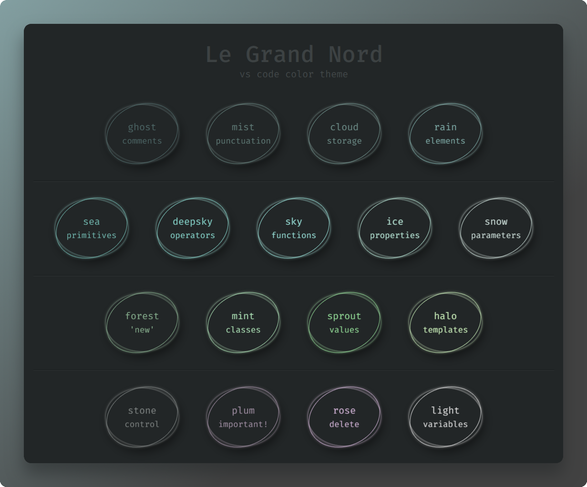

# Le Grand Nord – VS Code color theme

[🌍 Français](README_fr.md)

**For a clear vision**

Le Grand Nord is a beautiful, minimalist theme with medium contrast, designed for visual ease and focus. Inspired and inspiring with its cool Nordic tones and simple palette, this theme offers a serene, distraction-free space to immerse yourself in — like a Zen garden where creativity flows naturally. 🌱

## Le Grand Nord

### Javascript

> [!NOTE]
> Screenshot made with the VS Code extension `lit-html` installed to provide proper syntax highlighting inside tagged templates ( <code>html\`&lt;div>…&lt;/div>\`</code>)

### HTML / CSS

### Python

## Le Grand Nord – Higher Contrast

This theme provides a slightly darker background and clearer punctuation.

### Javascript

### HTML / CSS

### Python

<!-- ## Color palette

 -->

---

If you enjoy using this theme, please consider leaving a rating on the [Visual Studio Code Marketplace](https://marketplace.visualstudio.com/items?itemName=ncodefun.le-grand-nord). Your feedback is greatly appreciated! 💖

---

**Tags**: *#nord #flow #concentration #focus #zen #simple #serenity #beautiful*

## License

[MIT](LICENSE)
