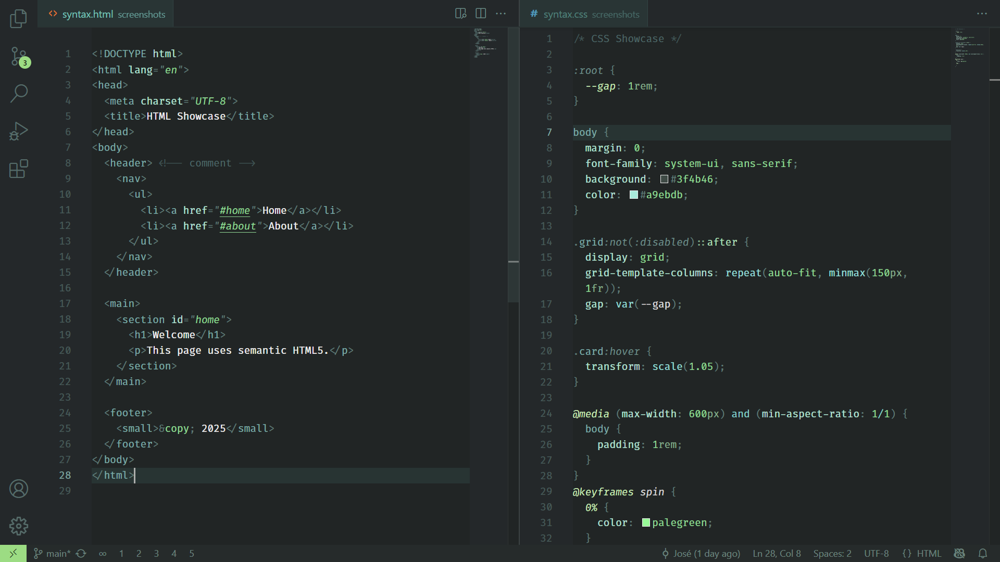
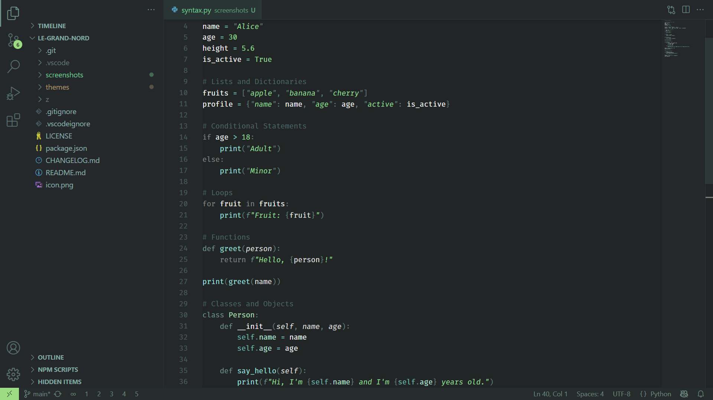
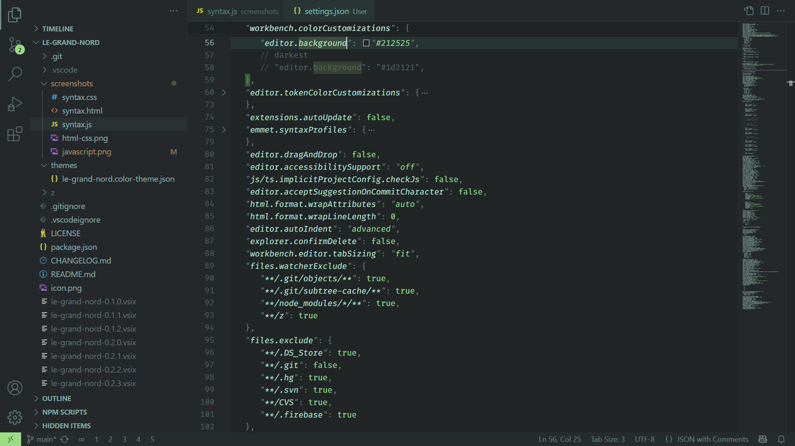
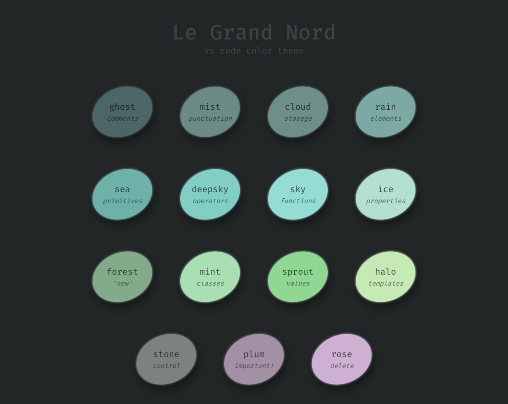
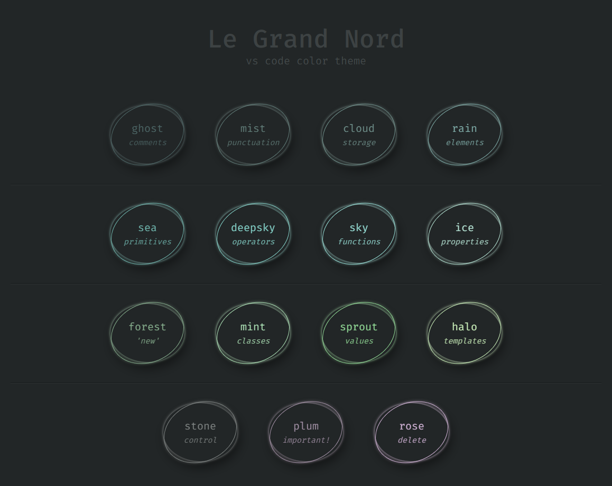

# Le Grand Nord – Un thème sombre pour VS Code

### [👉 English](README.md)

Une palette de couleurs minimaliste aux tons froids avec un contraste moyen, pour une esthétique calme et cohérente.


## Aperçu

### Javascript


### HTML / CSS


**Tags**: *#nord #flow #concentration #focus #zen #simple #beautiful*


## Plus de contraste

Pour obtenir un meilleur contraste, ajoutez ceci dans vos `user settings (JSON)` :

```jsonc
"workbench.colorCustomizations": {
	// plus sombre :
	"editor.background": "#212525",
	// encore plus sombre :
	// "editor.background": "#1d2121",
}
```


## Aperçu avec un fond plus sombre

### HTML / CSS


### Python


### JSON


## Palette de couleurs





## Contribuer

Votre contribution est la bienvenue ! Si vous avez des suggestions d'améliorations, n'hésitez pas à ouvrir une "issue".

Si vous utilisez et appréciez ce thème, pensez à laisser une évaluation sur le [Visual Studio Code Marketplace](https://marketplace.visualstudio.com/items?itemName=ncodefun.le-grand-nord). Votre soutien est grandement apprécié ! 💖


## Licence

[MIT](LICENSE)
