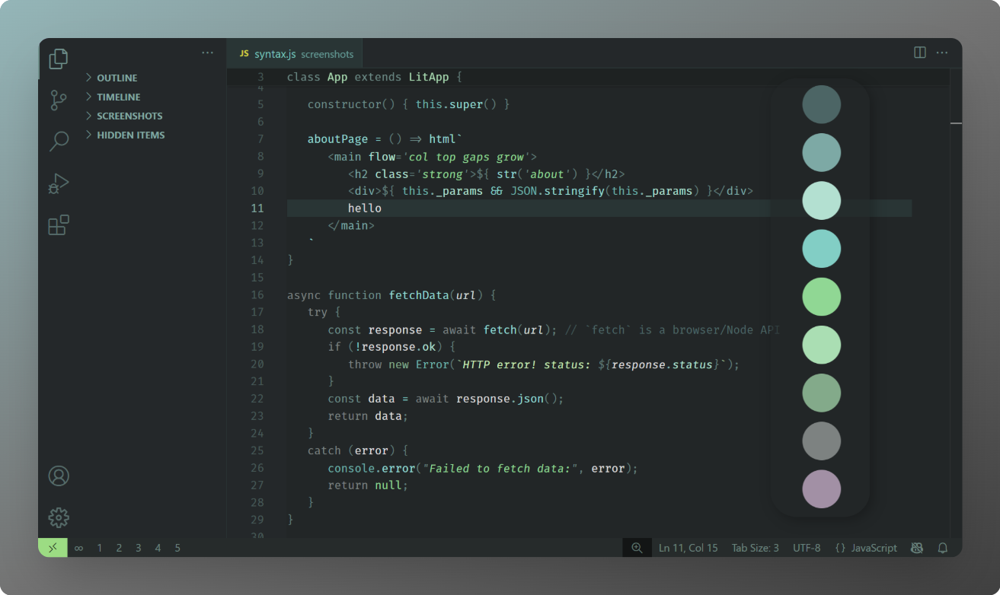
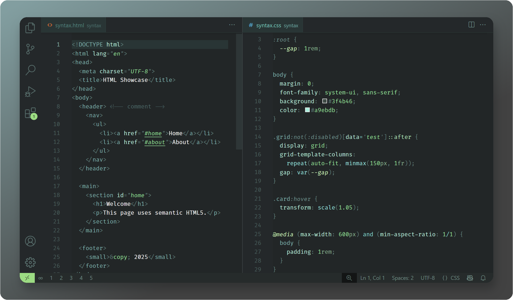
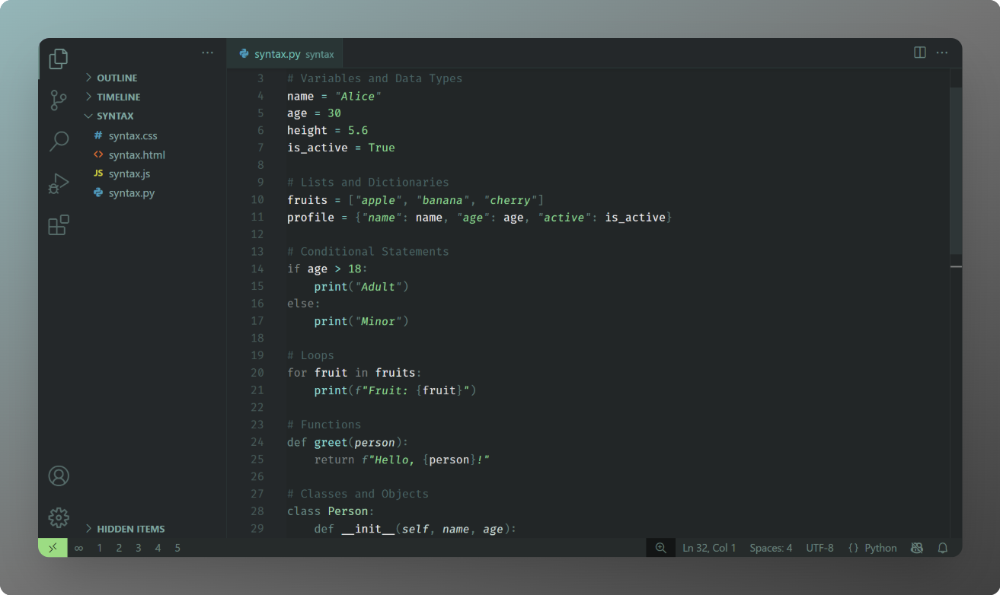
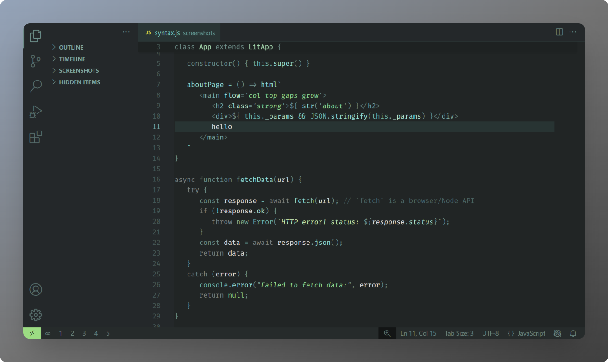
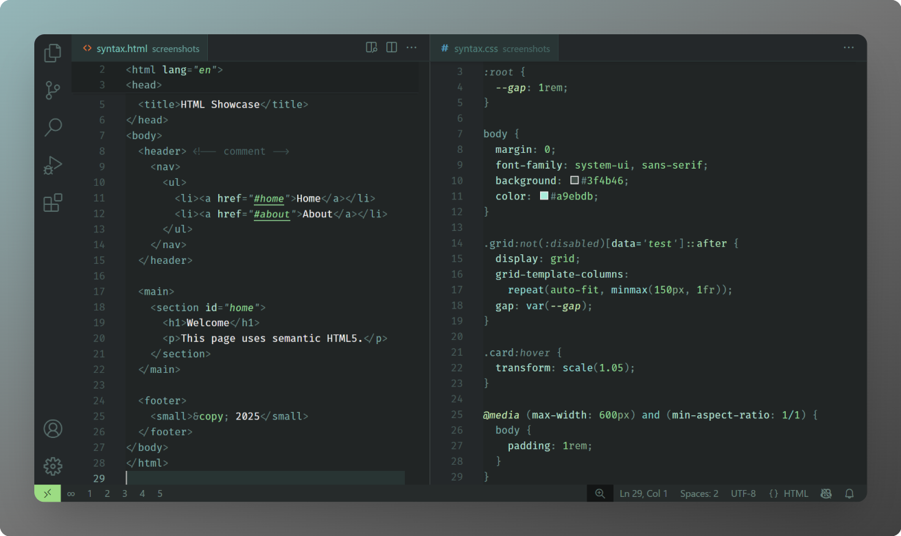
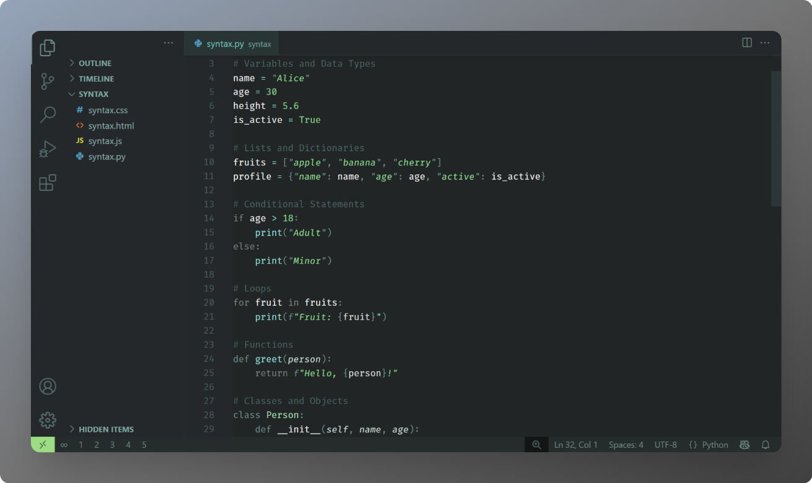
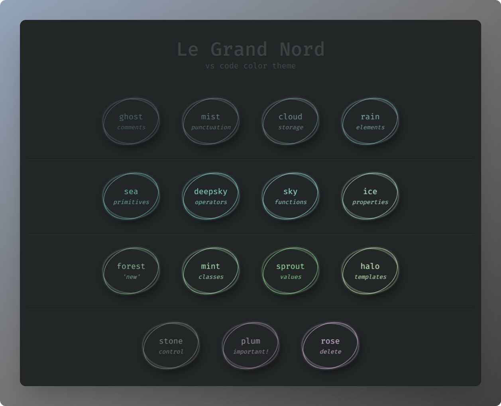
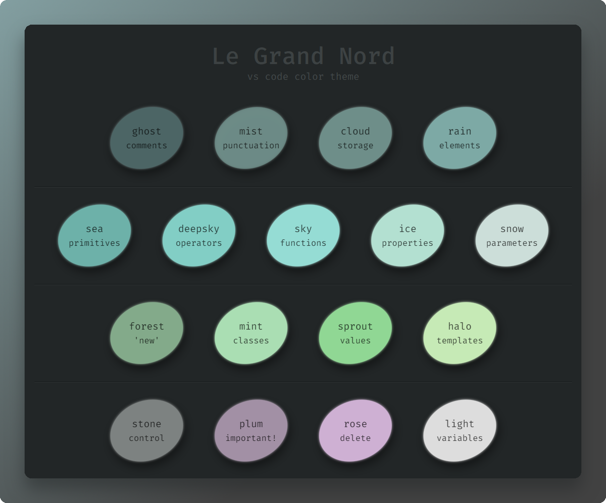

# Le Grand Nord – Un thème sombre pour VS Code

[👉 English](README.md)

Une palette de couleurs minimaliste aux tons froids avec un contraste moyen, pour une esthétique calme et cohérente.

## Le Grand Nord

### Javascript

### HTML / CSS

### Python

## Le Grand Nord – Higher Contrast

Ce thème a un arrière-plan légèrement plus sombre et une ponctuation plus claire.

### Javascript

### HTML / CSS

### Python

## Palette de couleurs

---

Si vous utilisez et appréciez ce thème, pensez à laisser une évaluation sur le [Visual Studio Code Marketplace](https://marketplace.visualstudio.com/items?itemName=ncodefun.le-grand-nord). Votre soutien est grandement apprécié ! 💖

---

**Tags**: *#nord #flow #concentration #focus #zen #simple #sérénité #élégant*

## Licence

[MIT](LICENSE)
